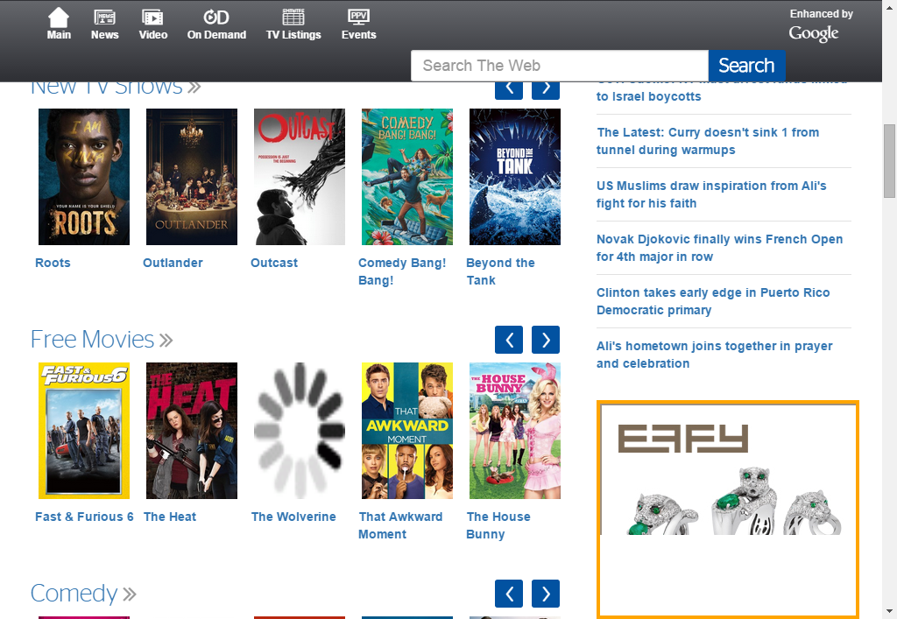
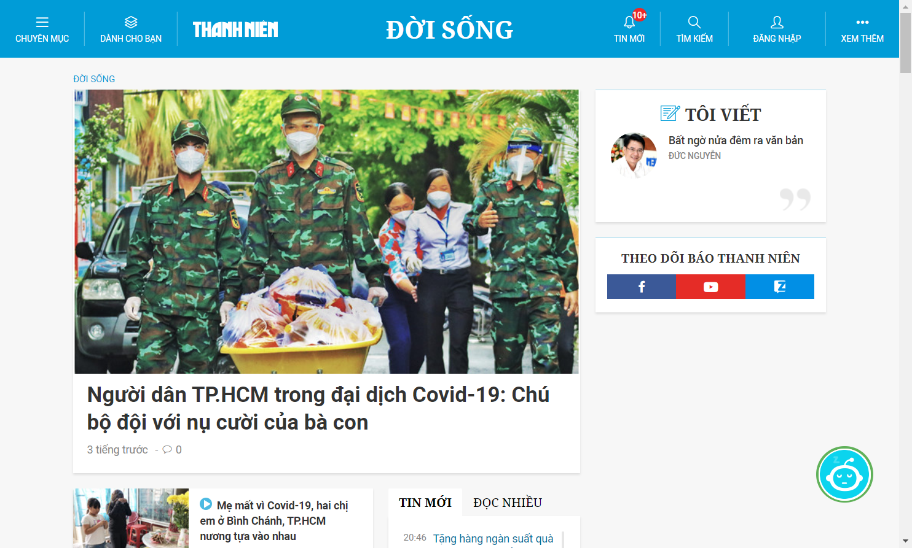

## Google drive: 
```
https://drive.google.com/drive/folders/1Hisyc2bCbI9K8K4R0dbNU7KyBrMlpDWH?usp=sharing
```
## Dataset:
-   ads: 1,248 images
    <ul>
    <li>thanhnien: 390 images</li>
    <li>dantri: 179 images</li>
    <li>tuoitre: 239 images</li>
    <li>vietnamnet: 192 images</li>
    <li>vnexpress: 64 images</li>
    <li>TWC: 184 images</li>
    </ul>
-   non_ads: 981 images
    <ul>
    <li>thanhnien: 369 images</li>
    <li>dantri: 220 images</li>
    <li>tuoitre: 0 images <i>(can not turn off ads)</i></li>
    <li>vietnamnet: 272 images</li>
    <li>vnexpress: 69 images</li>
    <li>TWC: 51 images</li>
    </ul>
## Tree Folder:
```
Folder Tree of data foler:

+---dataset
|   +---ctpn_output
|   |   +---testing_data
|   |   \---training_data
|   +---data
|   |   +---ads
|   |   +---ctpn_output
|   |   |   +---ads
|   |   |   \---non-ads
|   |   \---non_ads
|   +---testing_data
|   +---training_data
|   \---training_data_phase_2
|       +---ads
|       \---non_ads
+---demo
+---readme
+---res
\---res_oriented

```
## Sample:
-   ads
    <div>
    <p style="align:center;border:2px solid #007acc;margin: 4px"></p>
    <br>
    <p style="align:center;border:2px solid #007acc;margin: 4px"></p>
    <br>
    <p style="align:center;border:2px solid #007acc;margin: 4px"></p>
    </div>
    <br>
-   non_ads
    <div>
    <p style="align:center;border:2px solid #007acc;margin: 4px"></p>
    <br>
    <p style="align:center;border:2px solid #007acc;margin: 4px"></p>
    <br>
    <p style="align:center;border:2px solid #007acc;margin: 4px"></p>
    </div>
  
