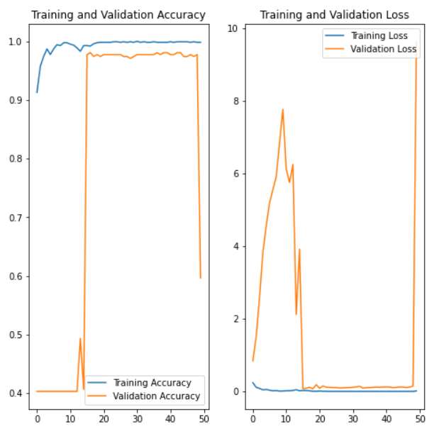

# Models for classify ads and non ads image
## Resnet
[](https://colab.research.google.com/drive/1idCyiGacw8aMFh9_WTsX-TIxDzWH2yBt?usp=sharing&fbclid=IwAR0likSFXw_jp_AHKn6Efsh86qzZUxN8kv7sInJAeH5dcpXvBQX9pUXOpwM)
- Weight Files:
  [Google Drive](https://drive.google.com/drive/folders/1Ei48qmtRVYPlQMuzQA_hL2qJq3gTC4Sw?fbclid=IwAR03psRqtLxESr-VTbXT_NkF6Htd17QDLMgPRQ276r9jYsYpgorr0QfjXCs)
- Status:
<p align="center">
  
</p>
<ul>
<li> Using 10 epoch:

```
Epoch 00007: saving model to /content/gdrive/MyDrive/model/cp-0007.ckpt
Epoch 8/10
50/50 [==============================] - 63s 1s/step - loss: 0.1435 - accuracy: 0.9594 - val_loss: 0.1878 - val_accuracy: 0.9474

Epoch 00008: saving model to /content/gdrive/MyDrive/model/cp-0008.ckpt
Epoch 9/10
50/50 [==============================] - 62s 1s/step - loss: 0.1316 - accuracy: 0.9638 - val_loss: 0.1788 - val_accuracy: 0.9398

Epoch 00009: saving model to /content/gdrive/MyDrive/model/cp-0009.ckpt
Epoch 10/10
50/50 [==============================] - 62s 1s/step - loss: 0.1201 - accuracy: 0.9688 - val_loss: 0.1852 - val_accuracy: 0.9474
```
</ul>

## Xception

[](https://colab.research.google.com/drive/1xtpRTJWTl6v_gruG6Syw82B_SjR_8WYd?usp=sharing)
- Google Drive: 
  ```
  https://drive.google.com/drive/folders/1Hisyc2bCbI9K8K4R0dbNU7KyBrMlpDWH?usp=sharing
  ```
- Status: 
<p align="center">
  
</p>
<ul>
<li> Using 10 epoch:

```
Epoch 48/50
55/55 [==============================] - 62s 1s/step - loss: 0.0177 - accuracy: 0.9942 - val_loss: 0.2193 - val_accuracy: 0.9145
Epoch 49/50
55/55 [==============================] - 63s 1s/step - loss: 0.0638 - accuracy: 0.9734 - val_loss: 2.3698 - val_accuracy: 0.7275
Epoch 50/50
55/55 [==============================] - 63s 1s/step - loss: 0.0390 - accuracy: 0.9844 - val_loss: 8.7965 - val_accuracy: 0.5381
```
</ul>

